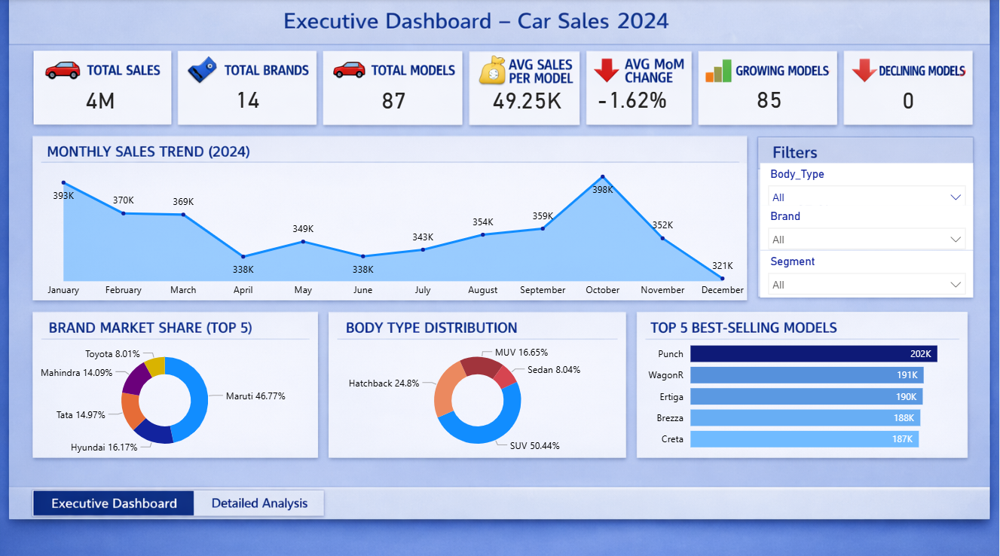
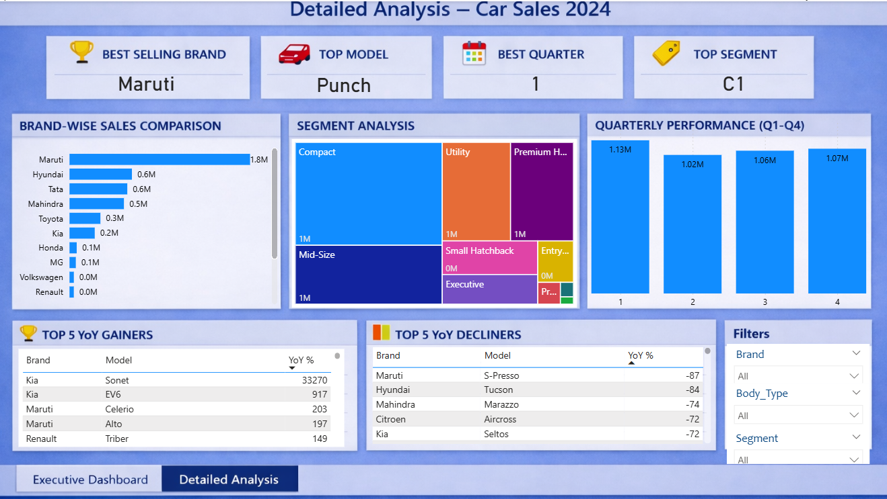

# 🚗 Car Sales Analysis – India 2024
### Power BI Dashboard Project

---

## 📌 Objective
Analyze Indian car market performance in 2024 across brands, models, segments, and body types to identify sales trends, market leaders, and growth opportunities.

---

## 🛠️ Tools Used
- **Power BI** — Dashboard & Visualizations
- **Power Query** — Data Cleaning & Transformation
- **DAX** — Measures & Calculations
- **Microsoft Excel** — Data Source

---

## 📊 Dataset Overview

| Field | Details |
|-------|---------|
| Records | 1,044 rows (87 models × 12 months) |
| Total Brands | 14 |
| Total Models | 87 |
| Time Period | January – December 2024 |
| Key Metric | Monthly Sales |
| Key Fields | Make, Model, Segment, Body Type, Monthly Sales |

---

## 🗂️ Data Model
Designed using a **Star Schema** for optimal Power BI performance.

```
FACT_Sales (Central Fact Table)
    ├── DIM_Calendar
    ├── DIM_Brand
    ├── DIM_Segment
    └── DIM_BodyType
```

- Monthly columns **unpivoted** using Power Query for time-series analysis
- All relationships: **One-to-Many** (Dimension → Fact)

---

## 🧮 DAX Measures

### Core Metrics
| Measure | Description |
|---------|-------------|
| Total Sales | Sum of all units sold |
| Total Brands | Count of distinct brands |
| Total Models | Count of distinct models |
| Avg Sales per Model | Average monthly performance |

### Trend Analysis
| Measure | Description |
|---------|-------------|
| MoM Change | Month-over-month growth % |
| Previous Month Sales | Comparison baseline |
| Growing Models | Count of models with positive MoM |
| Declining Models | Count of models with negative MoM |

### Rankings
- Top Brand, Top Model, Top Segment, Top Quarter

---

## 💡 Key Insights
- 📈 Total sales reached **4 million units** across 14 brands
- 🏆 **Maruti leads** with **46.77% market share**
- 🚙 **Punch** is the top-selling model
- 🚐 **SUVs dominate** at **50.44%** of total sales
- 🎉 **October** is peak sales month — driven by festive season
- 📊 Top 4 brands contribute **nearly 80%** of total market share
- 📉 S-Presso and Tucson recorded the highest sales decline

---

## 📋 Business Recommendations
- 🔧 Focus corrective actions on consistently declining models
- 🎯 Leverage festive season demand for targeted campaigns
- 💎 Explore growth opportunities in the premium segment
- ⚡ Monitor emerging EV adoption trends

---

## 📸 Screenshots

### Executive Summary


### Detailed Analysis


---

## 📁 Files

| File | Description |
|------|-------------|
| `Car_Sales_2024.pbix` | Power BI dashboard file |
| `README.md` | Project documentation |

---

## 👩‍💻 Author

**Eva Reji** — Data Analytics | Power BI | DAX

- 🐙 **GitHub:** [github.com/EvaReji](https://github.com/EvaReji)
- 💼 **LinkedIn:** [linkedin.com/in/eva-reji](https://linkedin.com/in/eva-reji)
- 📧 **Email:** evareji01@gmail.com
